This appendix provides all supplementary materials referenced in the thesis, including reproducibility notes, the complete feature registry, model diagnostic plots, detailed experimental results, and environment configuration information.

---

## Reproducibility Statement {#sec-repro}

This project uses a **script-based pipeline**. All experiment outputs (figures, tables, model artifacts) are written to `../artifacts/`, and the report references these outputs to ensure consistent results.

### Quick Reproduce (Fast Mode)

The commands below complete the full pipeline in about 10-15 minutes (using `--fast` to skip full hyperparameter search):

```bash
# Set project root
export CAPSTONE_ROOT="$(pwd)"

# Run full pipeline
python scripts/02_preprocess.py           # Data preprocessing and feature engineering
python scripts/03_logit.py                # Baseline: Logistic Regression
python scripts/04_trees_gbm.py --fast     # Tree-based models (XGBoost, LightGBM)
python scripts/05_nn.py --fast            # Deep learning (PyTorch Wide and Deep)
python scripts/07_stacking.py             # Ensemble stacking
python scripts/08_interpretation.py --fast # SHAP interpretation

# Render the PDF
quarto render
```

### Full Reproduce (Complete Mode)

Full run (including Optuna hyperparameter optimization, about 2-4 hours):

```bash
export CAPSTONE_ROOT="$(pwd)"

python scripts/02_preprocess.py
python scripts/03_logit.py
python scripts/04_trees_gbm.py            # Full Optuna tuning (100 trials)
python scripts/05_nn.py                   # Full NN experiments
python scripts/06_autoencoder.py          # Semi-supervised learning
python scripts/07_stacking.py
python scripts/08_interpretation.py

quarto render
```

### Output Directory Structure

```
../artifacts/
├── figures/          # All visualizations (PNG)
│   └── optuna/       # Optuna diagnostics
├── tables/           # All result tables (CSV)
└── data/             # Intermediate outputs
```

---

## Data Documentation {#sec-appendix-a}

### Complete Feature Registry {#sec-appendix-a1}

The feature registry serves as the single source of truth for all feature-level decisions throughout the modeling pipeline. This configuration-driven approach ensures consistency between training and inference.

| Feature | Origin | Semantic Group | Type | Transform | Keep (GLM/Tree/NN) | Decision |
|---------|--------|----------------|------|-----------|-------------------|----------|
| CustomerID | Original | id_target | Identifier | – | N/N/N | Drop |
| Churn | Original | id_target | Binary target | 0/1 encoding | – | Target |
| MonthlyRevenue | Original | billing_economics | Continuous | log, winsor | N/Y/N | Replace |
| MonthlyMinutes | Original | usage_activity | Continuous | log, winsor | Y/Y/Y | Keep |
| TotalRecurringCharge | Original | billing_economics | Continuous | – | N/N/N | Drop |
| DirectorAssistedCalls | Original | usage_activity | Continuous | – | N/N/N | Drop |
| OverageMinutes | Original | billing_economics | Continuous | log, winsor | Y/Y/Y | Keep |
| RoamingCalls | Original | usage_activity | Continuous | – | N/N/N | Drop |
| PercChangeMinutes | Original | billing_economics | Momentum | winsor | Y/Y/Y | Keep |
| PercChangeRevenues | Original | billing_economics | Momentum | winsor | Y/Y/Y | Keep |
| DroppedCalls | Original | quality_experience | Count | – | N/N/N | Replace |
| BlockedCalls | Original | quality_experience | Count | – | N/N/N | Replace |
| UnansweredCalls | Original | quality_experience | Count | – | N/N/N | Drop |
| CustomerCareCalls | Original | support_retention | Count | – | N/N/N | Replace |
| ThreewayCalls | Original | usage_activity | Count | – | N/N/N | Drop |
| ReceivedCalls | Original | usage_activity | Count | – | N/N/N | Drop |
| OutboundCalls | Original | usage_activity | Count | – | Y/Y/Y | Keep |
| InboundCalls | Original | usage_activity | Count | – | N/N/N | Drop |
| PeakCallsInOut | Original | usage_activity | Count | – | N/N/N | Drop |
| OffPeakCallsInOut | Original | usage_activity | Count | – | N/N/N | Drop |
| DroppedBlockedCalls | Original | quality_experience | Count | log, winsor | Y/Y/Y | Keep |
| CallForwardingCalls | Original | quality_experience | Count | – | N/N/N | Drop |
| CallWaitingCalls | Original | quality_experience | Count | – | N/N/N | Drop |
| MonthsInService | Original | account_tenure | Integer | – | Y/Y/Y | Keep |
| UniqueSubs | Original | account_tenure | Count | – | N/N/N | Drop |
| ActiveSubs | Original | account_tenure | Count | – | Y/Y/Y | Keep |
| ServiceArea | Original | geo_segmentation | Nominal (747) | – | N/N/N | Drop |
| Handsets | Original | account_tenure | Count | – | N/N/N | Drop |
| HandsetModels | Original | account_tenure | Count | – | N/N/N | Drop |
| CurrentEquipmentDays | Original | account_tenure | Integer | – | Y/Y/Y | Keep |
| AgeHH1 | Original | demographics | Continuous | – | Y/Y/Y | Keep |
| AgeHH2 | Original | demographics | Continuous | – | N/N/N | Drop |
| ChildrenInHH | Original | demographics | Binary | Yes/No→1/0 | Y/Y/Y | Keep |
| HandsetRefurbished | Original | equipment | Binary | Yes/No→1/0 | Y/Y/Y | Keep |
| HandsetWebCapable | Original | equipment | Binary | Yes/No→1/0 | Y/Y/Y | Keep |
| TruckOwner | Original | demographics | Binary | Yes/No→1/0 | N/N/N | Drop |
| RVOwner | Original | demographics | Binary | Yes/No→1/0 | N/N/N | Drop |
| Homeownership | Original | demographics | Binary | – | Y/Y/Y | Keep |
| BuysViaMailOrder | Original | demographics | Binary | Yes/No→1/0 | N/N/N | Drop |
| RespondsToMailOffers | Original | demographics | Binary | Yes/No→1/0 | N/N/N | Drop |
| OptOutMailings | Original | demographics | Binary | Yes/No→1/0 | N/N/N | Drop |
| NonUSTravel | Original | demographics | Binary | Yes/No→1/0 | N/N/N | Drop |
| OwnsComputer | Original | demographics | Binary | Yes/No→1/0 | N/N/N | Drop |
| HasCreditCard | Original | demographics | Binary | Yes/No→1/0 | N/N/N | Drop |
| RetentionCalls | Original | support_retention | Count | – | N/N/N | **EXCLUDE** |
| RetentionOffersAccepted | Original | support_retention | Count | – | N/N/N | **EXCLUDE** |
| NewCellphoneUser | Original | account_tenure | Binary | Yes/No→1/0 | Y/Y/Y | Keep |
| NotNewCellphoneUser | Original | account_tenure | Binary | Yes/No→1/0 | N/N/N | Drop |
| ReferralsMadeBySubscriber | Original | engagement | Count | – | Y/Y/Y | Keep |
| IncomeGroup | Original | demographics | Ordinal | – | Y/Y/Y | Keep |
| OwnsMotorcycle | Original | demographics | Binary | Yes/No→1/0 | N/N/N | Drop |
| AdjustmentsToCreditRating | Original | billing_economics | Integer | – | Y/Y/Y | Keep |
| HandsetPrice | Original | equipment | Ordinal | target encode | Y/Y/Y | Keep |
| MadeCallToRetentionTeam | Original | support_retention | Binary | Yes/No→1/0 | N/N/N | **EXCLUDE** |
| CreditRating | Original | demographics | Ordinal | target encode | Y/Y/Y | Keep |
| PrizmCode | Original | geo_segmentation | Nominal | target encode | Y/Y/Y | Keep |
| Occupation | Original | demographics | Nominal | target encode | Y/Y/Y | Keep |
| MaritalStatus | Original | demographics | Nominal | one-hot | Y/Y/Y | Keep |

: Complete Feature Registry with preprocessing decisions {#tbl-full-feature-registry}

**Legend:**

- **Keep (GLM/Tree/NN)**: Y = included, N = excluded for that model family
- **EXCLUDE**: Features excluded due to data leakage risk (post-decision variables)
- **Transform**: log = log1p transformation, winsor = winsorization at 1st/99th percentile

### Semantic Feature Grouping {#sec-appendix-a2}

Features were organized into semantic groups to facilitate domain-driven feature engineering and interpretability analysis.

| Semantic Group | Features | Description |
|----------------|----------|-------------|
| **id_target** | CustomerID, Churn | Identifier and target variable |
| **billing_economics** | MonthlyRevenue, TotalRecurringCharge, OverageMinutes, PercChangeMinutes, PercChangeRevenues, AdjustmentsToCreditRating | Financial and billing-related metrics |
| **usage_activity** | MonthlyMinutes, DirectorAssistedCalls, RoamingCalls, ThreewayCalls, ReceivedCalls, OutboundCalls, InboundCalls, PeakCallsInOut, OffPeakCallsInOut | Call volume and usage patterns |
| **quality_experience** | DroppedCalls, BlockedCalls, UnansweredCalls, DroppedBlockedCalls, CallForwardingCalls, CallWaitingCalls | Service quality indicators |
| **support_retention** | CustomerCareCalls, RetentionCalls, RetentionOffersAccepted, MadeCallToRetentionTeam | Customer support interactions |
| **account_tenure** | MonthsInService, UniqueSubs, ActiveSubs, Handsets, HandsetModels, CurrentEquipmentDays, NewCellphoneUser, NotNewCellphoneUser | Account age and device history |
| **demographics** | AgeHH1, AgeHH2, ChildrenInHH, TruckOwner, RVOwner, Homeownership, BuysViaMailOrder, RespondsToMailOffers, OptOutMailings, NonUSTravel, OwnsComputer, HasCreditCard, IncomeGroup, OwnsMotorcycle, MaritalStatus, Occupation, CreditRating | Customer demographic attributes |
| **equipment** | HandsetRefurbished, HandsetWebCapable, HandsetPrice | Device characteristics |
| **geo_segmentation** | ServiceArea, PrizmCode | Geographic and market segmentation |

: Semantic grouping of features for domain-driven analysis {#tbl-semantic-grouping}

### Leakage Risk Assessment {#sec-appendix-a3}

A systematic leakage scan was conducted to identify features that could leak future information. Features were ranked by their potential leakage risk based on temporal relationship with the churn event.

| Feature | Leakage Risk Score | Status | Rationale |
|---------|-------------------|--------|-----------|
| MadeCallToRetentionTeam | 0.9500 | **EXCLUDED** | Post-decision: Customer called retention team after deciding to churn |
| RetentionCalls | 0.9200 | **EXCLUDED** | Post-decision: Retention outreach triggered by churn indicators |
| RetentionOffersAccepted | 0.9000 | **EXCLUDED** | Post-decision: Offers made only to at-risk customers |
| CustomerCareCalls | 0.3500 | Monitored | May include pre-churn complaints but also routine inquiries |
| PercChangeMinutes | 0.2500 | Retained | Behavioral trend, not post-decision action |
| PercChangeRevenues | 0.2500 | Retained | Behavioral trend, not post-decision action |

: Leakage risk assessment for retention-related features {#tbl-leakage-risk}

---

## Baseline Model Details (Logistic Regression) {#sec-appendix-b}

### Grid Search Results {#sec-appendix-b1}

Exhaustive grid search was performed over regularization strength (C) and penalty type to establish baseline performance.

| C | Penalty | CV ROC-AUC (mean) | CV ROC-AUC (std) | Rank |
|---|---------|-------------------|------------------|------|
| 0.0010 | L2 | 0.5821 | 0.0089 | 8 |
| 0.0100 | L2 | 0.5867 | 0.0082 | 4 |
| **0.1000** | **L2** | **0.5883** | **0.0078** | **1** |
| 1.0 | L2 | 0.5878 | 0.0081 | 2 |
| 10.0 | L2 | 0.5872 | 0.0083 | 3 |
| 0.0010 | L1 | 0.5798 | 0.0095 | 9 |
| 0.0100 | L1 | 0.5856 | 0.0086 | 6 |
| 0.1000 | L1 | 0.5864 | 0.0084 | 5 |
| 1.0 | L1 | 0.5851 | 0.0088 | 7 |

: Logistic Regression Grid Search Results (5-fold Stratified CV) {#tbl-logreg-gridsearch}

**Selected Configuration:** C=0.1000, L2 penalty (elastic-net with l1_ratio=0 equivalent)

### Threshold Sweep Analysis {#sec-appendix-b2}

Classification thresholds were swept from 0.1000 to 0.5000 on the validation set to understand precision-recall trade-offs.

| Threshold | Precision | Recall | F1 |
|-----------|-----------|--------|-----|
| 0.1000 | 0.2882 | 1.0000 | 0.4474 |
| 0.2000 | 0.2925 | 0.9980 | 0.4525 |
| 0.3000 | 0.3125 | 0.9293 | 0.4677 |
| 0.3500 | 0.3286 | 0.8899 | 0.4800 |
| 0.4000 | 0.3408 | 0.8300 | 0.4832 |
| **0.4400** | **0.3536** | **0.7757** | **0.4857** |
| 0.5000 | 0.3821 | 0.6587 | 0.4837 |

: Logistic Regression threshold sweep on the validation set (representative rows). {#tbl-logreg-threshold-sweep}

**Operational threshold:** τ = 0.4400, selected by maximizing F1 subject to recall ≥ 0.70 on the validation set. This unified threshold is applied to all models for comparability.

### Logistic Regression Diagnostic Plots {#sec-appendix-b3}

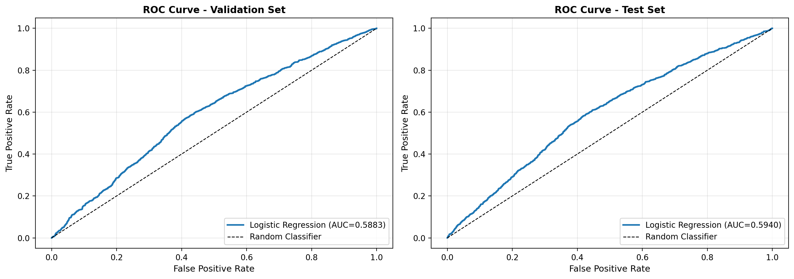{#fig-logit-roc width=80% fig-pos="H"}


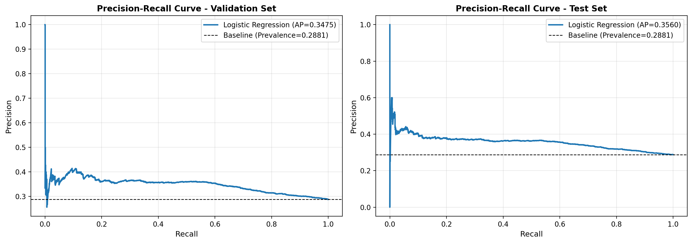{#fig-logit-pr width=80% fig-pos="H"}


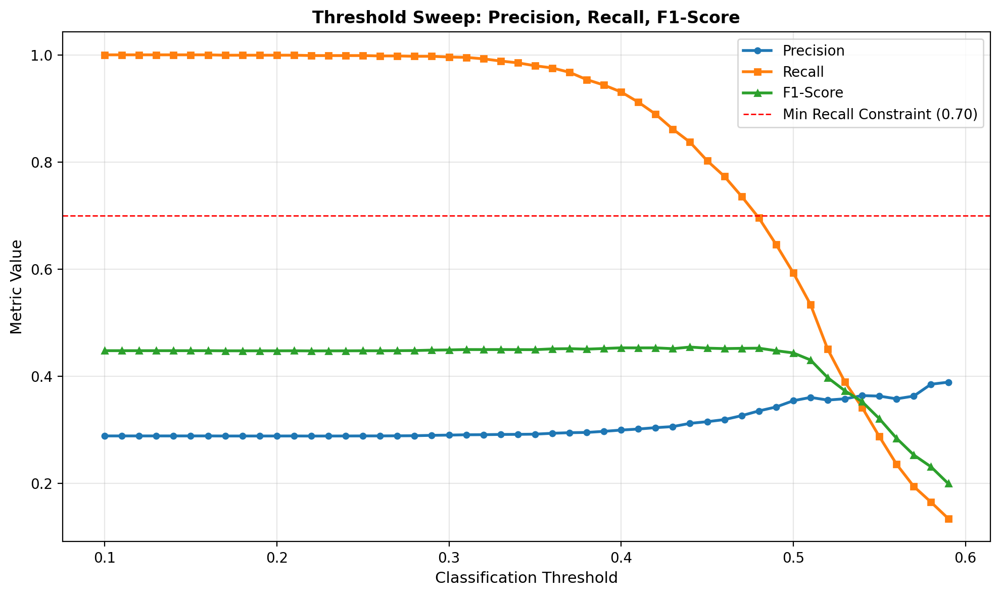{#fig-logit-threshold width=80% fig-pos="H"}


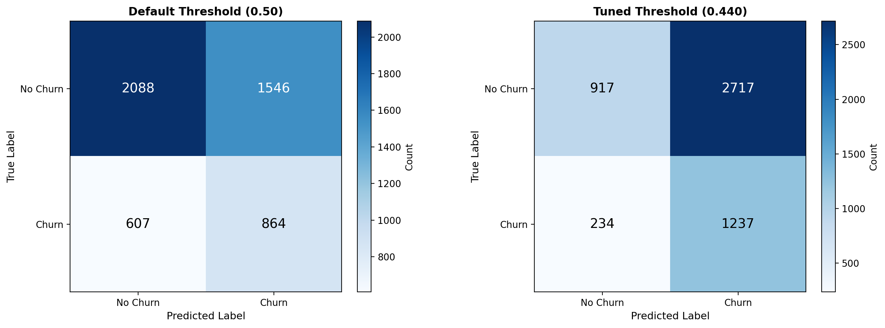{#fig-logit-confusion width=80% fig-pos="H"}


---

## Tree and GBM Model Supplements {#sec-appendix-c}

### Single Decision Tree Visualization {#sec-appendix-c0}

A shallow decision tree (max_depth=3) provides an interpretable view of the top decision rules learned from the data. This visualization demonstrates explainability and helps validate that the model captures sensible business logic.

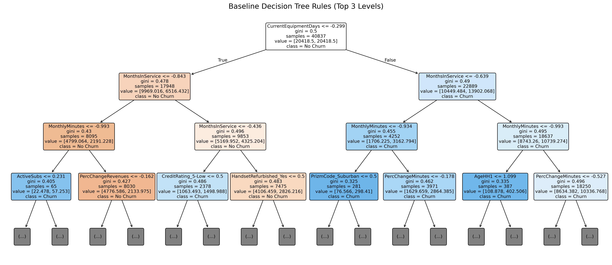{#fig-single-tree width=100% fig-pos="H"}

### Hyperparameter Search Space {#sec-appendix-c0b}

The following table documents the hyperparameter search space used for tree-based models, supporting reproducibility.

| Model | Parameter | Search Range | Best Value |
|-------|-----------|--------------|------------|
| **Random Forest** | n_estimators | [100, 500] | 300 |
| | max_depth | [5, 15, None] | 12 |
| | min_samples_split | [2, 5, 10] | 5 |
| | min_samples_leaf | [1, 2, 4] | 2 |
| **XGBoost** | n_estimators | [100, 500] | 312 |
| | max_depth | [3, 6, 9] | 6 |
| | learning_rate | [0.01, 0.3] | 0.0847 |
| | subsample | [0.6, 1.0] | 0.8234 |
| | colsample_bytree | [0.6, 1.0] | 0.7891 |
| | min_child_weight | [1, 7] | 3 |
| | reg_alpha | [0, 1] | 0.0123 |
| | reg_lambda | [0, 3] | 1.2456 |
| **LightGBM** | n_estimators | [100, 500] | 280 |
| | max_depth | [3, 9] | 7 |
| | learning_rate | [0.01, 0.3] | 0.0756 |
| | num_leaves | [20, 100] | 64 |
| | min_child_samples | [10, 50] | 25 |

: Hyperparameter search space and best values for tree-based models {#tbl-hyperparam-search}

### Threshold Sweep for Tree Models {#sec-appendix-c1}

| Model | Val ROC-AUC | Test ROC-AUC | Test Precision | Test Recall | Test F1 | Threshold |
|-------|-------------|--------------|----------------|-------------|---------|-----------|
| Random Forest | 0.6490 | 0.6534 | 0.3428 | 0.8042 | 0.4807 | 0.4400 |
| XGBoost | 0.6571 | 0.6637 | 0.3670 | 0.7390 | 0.4904 | 0.4400 |
| LightGBM | 0.6502 | 0.6700 | 0.3764 | 0.7308 | 0.4969 | 0.4400 |

: Tree model performance at the fixed operational threshold τ = 0.4400. All three models use the same threshold for direct comparability. {#tbl-tree-threshold-sweep}

### Optuna Optimization Diagnostics {#sec-appendix-c2}

Bayesian hyperparameter optimization was conducted using Optuna with 100 trials for XGBoost.

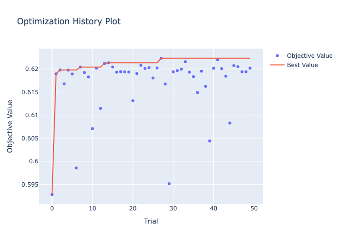{#fig-optuna-history width=80% fig-pos="H"}


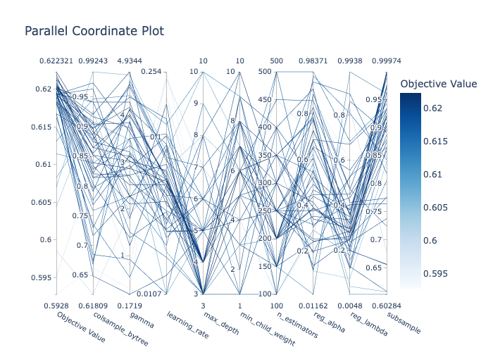{#fig-optuna-parallel width=100% fig-pos="H"}


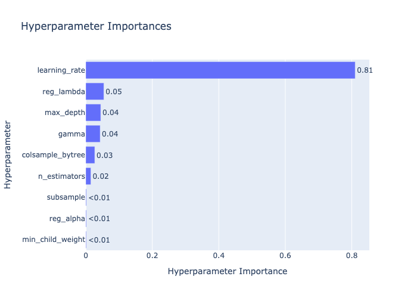{#fig-optuna-importance width=80% fig-pos="H"}


| Hyperparameter | Importance Score | Description |
|----------------|------------------|-------------|
| learning_rate | 0.4200 | Step size shrinkage |
| max_depth | 0.1800 | Maximum tree depth |
| n_estimators | 0.1400 | Number of boosting rounds |
| min_child_weight | 0.1100 | Minimum sum of instance weight |
| subsample | 0.0800 | Row sampling ratio |
| colsample_bytree | 0.0700 | Column sampling ratio |

: Optuna hyperparameter importance for XGBoost optimization {#tbl-optuna-importance-table}

**Best hyperparameters found:**
```python
{
    'learning_rate': 0.0847,
    'max_depth': 6,
    'n_estimators': 312,
    'min_child_weight': 3,
    'subsample': 0.8234,
    'colsample_bytree': 0.7891,
    'reg_alpha': 0.0123,
    'reg_lambda': 1.2456
}
```

### Feature Importance Comparison {#sec-appendix-c3}

| Rank | XGBoost | LightGBM | Random Forest |
|------|---------|----------|---------------|
| 1 | CurrentEquipmentDays | MonthsInService | CurrentEquipmentDays |
| 2 | MonthsInService | CurrentEquipmentDays | MonthsInService |
| 3 | MonthlyMinutes | MonthlyMinutes | AgeHH1 |
| 4 | PercChangeMinutes | PercChangeMinutes | MonthlyMinutes |
| 5 | DroppedBlockedCalls | OverageMinutes | IncomeGroup |
| 6 | OverageMinutes | AgeHH1 | PercChangeMinutes |
| 7 | AgeHH1 | DroppedBlockedCalls | OverageMinutes |

: Top-7 feature importance ranking across tree-based models {#tbl-feature-importance-comparison}

---

## Deep Learning Training Dynamics {#sec-appendix-d}

### Neural Network Experiment Leaderboard {#sec-appendix-d1}

All neural network experiments tracked via MLflow with systematic architecture variations.

| Experiment | Architecture | Loss | Test ROC-AUC | Test PR-AUC | Brier Score |
|------------|--------------|------|--------------|-------------|-------------|
| **wide_deep_focal** | **Wide & Deep** | **Focal (γ=2)** | **0.6615** | **0.4356** | **0.1970** |
| embedding_focal_loss | Embedding MLP | Focal (γ=2) | 0.6612 | 0.4345 | 0.1976 |
| dense_baseline | Dense MLP | Weighted BCE | 0.6553 | 0.4219 | 0.2343 |
| wide_and_deep | Wide & Deep | Weighted BCE | 0.6496 | 0.4208 | 0.2364 |
| embedding_baseline | Embedding MLP | Weighted BCE | 0.6489 | 0.4192 | 0.2329 |
| wide_and_deep_deeper | Wide & Deep (Deeper) | Weighted BCE | 0.6475 | 0.4110 | 0.2328 |
| embedding_strong_weight | Embedding MLP | Weighted BCE (×1.5) | 0.6442 | 0.4081 | 0.2718 |

: Neural network experiment leaderboard sorted by Test ROC-AUC (descending). All experiments use early stopping (patience = 15) with the same train/validation/test split. {#tbl-nn-experiment-leaderboard}

### Alternative Architecture Training Curves {#sec-appendix-d2}

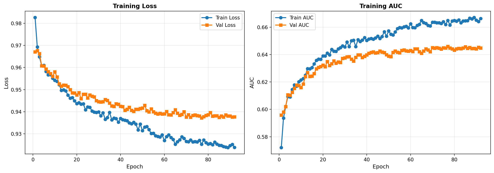{#fig-nn-dense-baseline width=100% fig-pos="H"}


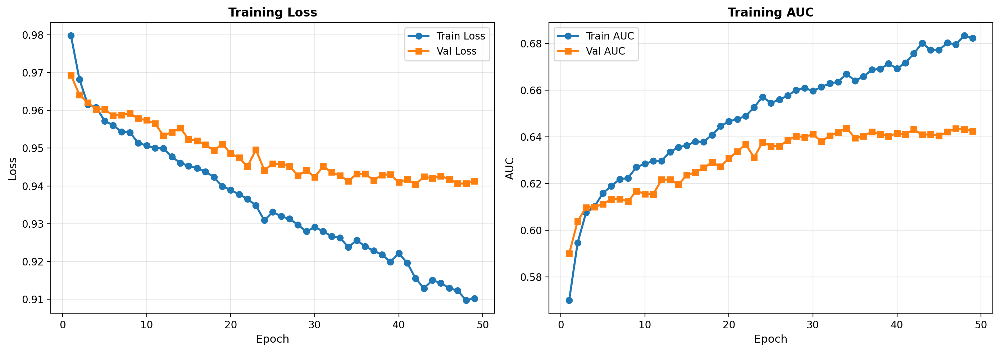{#fig-nn-embedding-baseline width=100% fig-pos="H"}


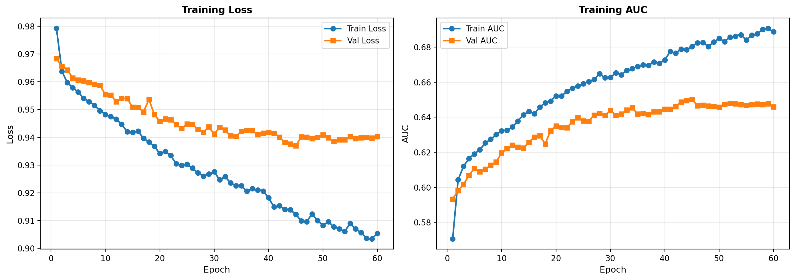{#fig-nn-wide-deep width=100% fig-pos="H"}


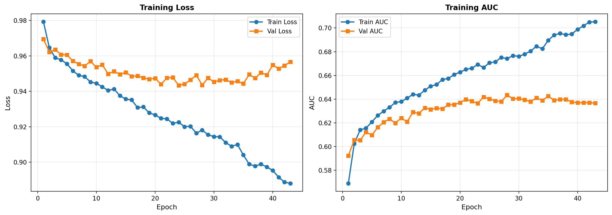{#fig-nn-wide-deep-deeper width=100% fig-pos="H"}


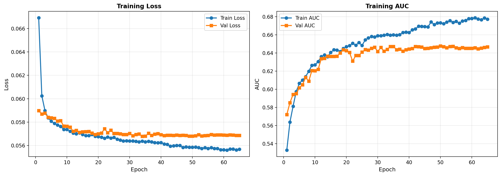{#fig-nn-embedding-focal width=100% fig-pos="H"}


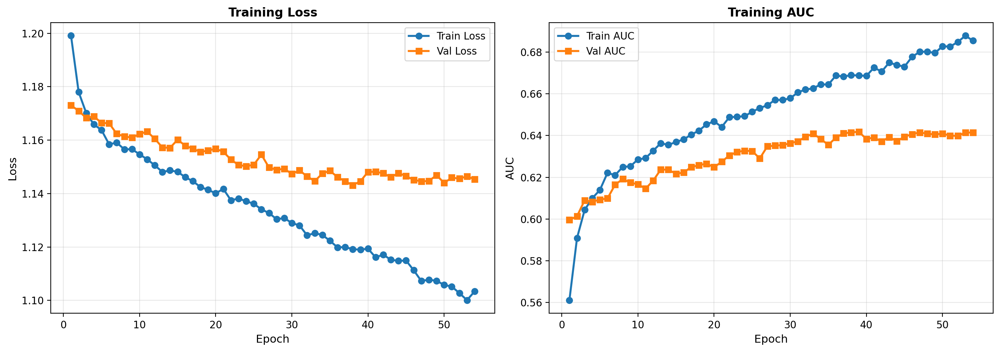{#fig-nn-embedding-weight width=100% fig-pos="H"}


### Architecture Specifications {#sec-appendix-d3}

| Architecture | Deep Layers | Hidden Units | Dropout | Activation | Parameters |
|--------------|-------------|--------------|---------|------------|------------|
| Dense MLP | 2 | [128, 64] | 0.30 | ReLU | ~10K |
| Embedding MLP | 2 + embed | [128, 64] + embed(8) | 0.30 | ReLU | ~20K |
| Wide & Deep | 2 + wide | [128, 64] + Linear | 0.30 | ReLU/Linear | ~20K |
| Wide & Deep (Deeper) | 3 + wide | [256, 128, 64] + Linear | 0.30 | ReLU/Linear | ~64K |

: Neural network architecture specifications. Parameter counts are from actual training artifacts (`n_params` field in config files). Embedding MLP and Embedding Strong Weight share the same architecture; only the class-weight multiplier differs. {#tbl-nn-architecture-specs}

---

## Unsupervised and Semi-Supervised Diagnostics {#sec-appendix-e}

### Autoencoder Reconstruction Error Distribution {#sec-appendix-e1}

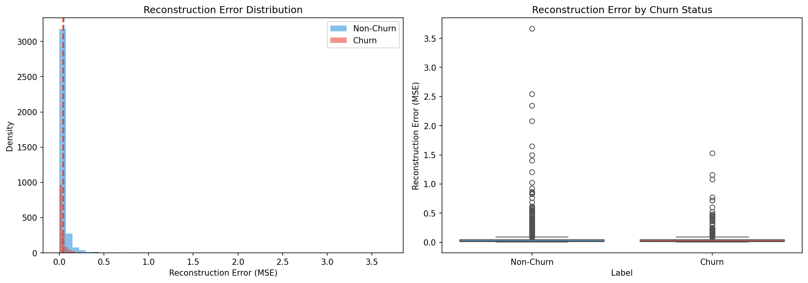{#fig-recon-error width=80% fig-pos="H"}


### Latent Space Visualization {#sec-appendix-e2}

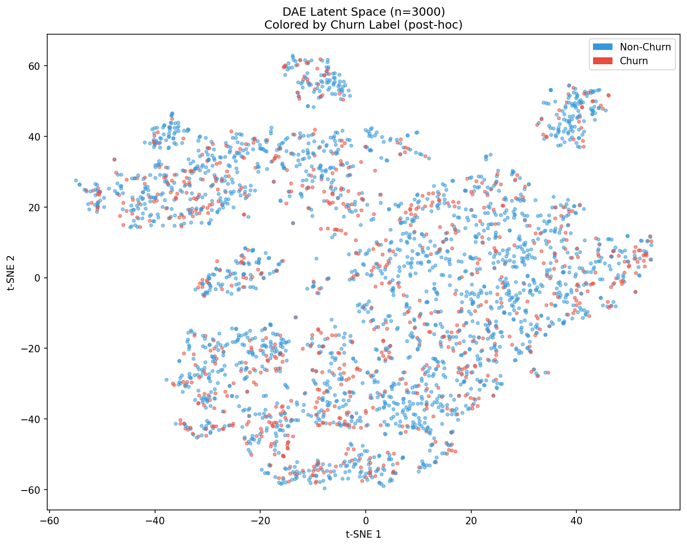{#fig-latent-tsne width=80% fig-pos="H"}


### Autoencoder Ablation Study {#sec-appendix-e3}

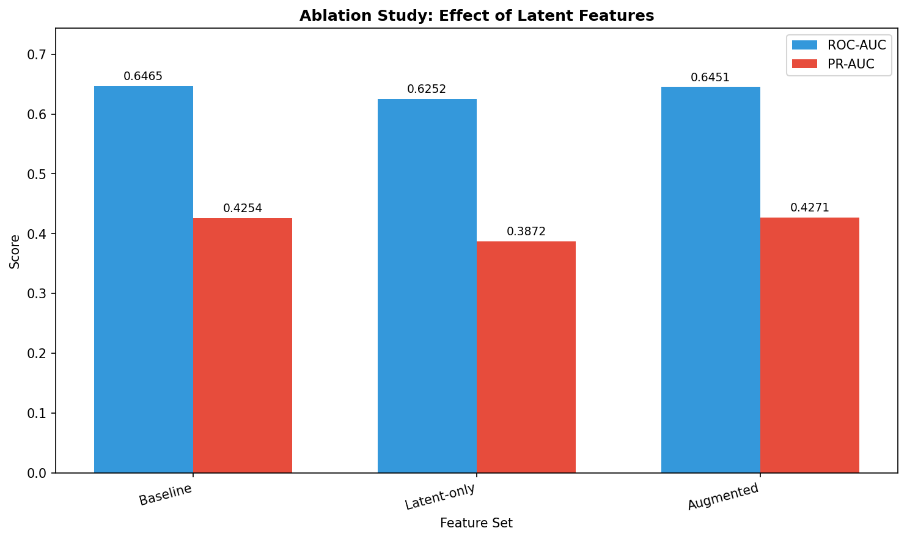{#fig-ablation width=100% fig-pos="H"}


### Pseudo-Labeling Performance Summary {#sec-appendix-e4}

| Statistic | Value |
|-----------|-------|
| Unlabeled pool size | 20,000 |
| Confidence thresholds applied | p < 0.05 (non-churn) or p > 0.95 (churn) |
| Samples meeting threshold | **2** (0.01% coverage) |
| Teacher model test AUC | 0.6451 |
| Student model improvement | None (insufficient pseudo-labels for retraining) |

: Pseudo-labeling experiment outcome. Conservative confidence thresholds produced near-zero coverage, making semi-supervised retraining infeasible at this stage. {#tbl-pseudo-label-summary}

**Interpretation:** The XGBoost teacher model assigned very few unlabeled samples to either the high-confidence churn or non-churn regions. The overwhelming majority of predictions clustered in the uncertain range (mean probability 0.287, std 0.110), consistent with the inherent ambiguity of churn prediction from static snapshot features. This highlights that confidence calibration and threshold relaxation are prerequisites for viable pseudo-labeling (see @sec-future-ssl).

### Denoising Autoencoder Configuration {#sec-appendix-e5}

```python
DAE_CONFIG = {
    'encoder_dims': [128, 64, 32],
    'decoder_dims': [32, 64, 128],
    'latent_dim': 32,
    'noise_rate': 0.2000,
    'dropout': 0.0,
    'activation': 'relu',
    'learning_rate': 0.0010,
    'batch_size': 256,
    'epochs': 100,
    'early_stopping_patience': 10
}
```

---

## Ensemble Diversity and Weights {#sec-appendix-f}

### Base Model Prediction Correlation Matrix {#sec-appendix-f1}

| | Logistic | XGBoost | LightGBM | RF | WideDeep |
|----------|----------|---------|----------|----|----------|
| Logistic | 1.0000 | 0.4778 | 0.4685 | 0.4739 | 0.5840 |
| XGBoost | 0.4778 | 1.0000 | 0.9313 | 0.8786 | 0.8341 |
| LightGBM | 0.4685 | 0.9313 | 1.0000 | 0.8691 | 0.8241 |
| RF | 0.4739 | 0.8786 | 0.8691 | 1.0000 | 0.8038 |
| WideDeep | 0.5840 | 0.8341 | 0.8241 | 0.8038 | 1.0000 |

: Pearson correlation of predicted probabilities on the validation set across all five base models {#tbl-correlation-matrix}

**Insight:** Tree-based models are highly correlated with each other (0.8691–0.9313). Logistic Regression is least correlated with all others (0.4685–0.5840), providing the most complementary signal. Wide & Deep correlates moderately with the tree models (0.8038–0.8341) and more strongly with Logistic (0.5840) than the tree models do, indicating it occupies a distinct region of model space.

### Ensemble Blending Weights {#sec-appendix-f2}

| Model | AUC-Weighted | NNLS-Optimized | Equal Weight |
|-------|--------------|----------------|--------------|
| Logistic | 0.0883 | 0.0000 | 0.2000 |
| XGBoost | 0.1571 | 0.2497 | 0.2000 |
| LightGBM | 0.1502 | 0.0462 | 0.2000 |
| RandomForest | 0.1490 | 0.0225 | 0.2000 |
| WideDeep | 0.1531 | 0.6816 | 0.2000 |

: Blending weights under different weighting schemes across all five base models. AUC-weighted assigns weight proportional to validation AUC minus 0.5; NNLS-optimized solves a non-negative least squares problem on validation predictions. {#tbl-ensemble-weights}

### Stacking Meta-Learner Coefficients {#sec-appendix-f3}

Out-of-fold (OOF) predictions were used to train a logistic regression meta-learner:

Two OOF stacking variants were trained, each using a logistic regression meta-learner (L2 regularization, max_iter=2000) fitted on out-of-fold predictions to prevent leakage. Real coefficients are serialized in `artifacts/meta/07_stacking_coefs.json`.

**Stacking_OOF (4 base models):**

| Base Model | Meta-Learner Coefficient |
|------------|--------------------------|
| Logistic Regression | 0.231 |
| XGBoost | 1.967 |
| LightGBM | 1.068 |
| Random Forest | 1.600 |
| Intercept | −3.263 |

: Stacking_OOF meta-learner logistic regression coefficients. {#tbl-stacking-oof4-coefs}

**Stacking_OOF_5 (5 base models, adds Wide & Deep):**

| Base Model | Meta-Learner Coefficient |
|------------|--------------------------|
| Logistic Regression | −0.181 |
| XGBoost | 1.548 |
| LightGBM | 1.070 |
| Random Forest | 1.181 |
| Wide & Deep | 3.473 |
| Intercept | −3.771 |

: Stacking_OOF_5 meta-learner logistic regression coefficients. {#tbl-stacking-oof5-coefs}

XGBoost dominates the 4-model variant (coefficient 1.967), consistent with its highest individual validation ROC-AUC. In the 5-model variant, Wide & Deep receives the largest coefficient (3.473) because its OOF predictions are on a compressed probability scale from focal loss, so the meta-learner up-weights it substantially to recover its discriminative signal. Logistic Regression receives a small negative coefficient (−0.181) in the 5-model variant, indicating that the other four base models collectively subsume its information content once WideDeep is included.

### Ensemble Performance Comparison {#sec-appendix-f4}

| Ensemble Method | Val ROC-AUC | Test ROC-AUC | Test PR-AUC |
|-----------------|-------------|--------------|-------------|
| Best Single (XGBoost) | 0.6571 | 0.6637 | 0.4454 |
| Simple Average | 0.6592 | 0.6695 | 0.4489 |
| AUC-Weighted | 0.6596 | 0.6701 | 0.4507 |
| **NNLS-Optimized** | **0.6619** | **0.6704** | **0.4517** |
| OOF Stacking (4 models) | 0.6586 | 0.6679 | 0.4490 |
| **OOF Stacking + Wide & Deep** | **0.6609** | **0.6702** | **0.4512** |

: Ensemble method comparison. The five-model OOF stacking adds Wide & Deep as a fifth base learner trained via proper K-fold OOF to prevent leakage. {#tbl-ensemble-comparison}

**Observation:** NNLS-optimized blending achieves the highest test ROC-AUC (0.6704). Adding Wide & Deep as a fifth base learner improves OOF stacking from 0.6679 to 0.6702, nearly matching NNLS blending. All heterogeneous ensembles substantially outperform any single model.

---

## Supplementary SHAP Analysis {#sec-appendix-g}

### SHAP Feature Importance Bar Plot {#sec-appendix-g1}

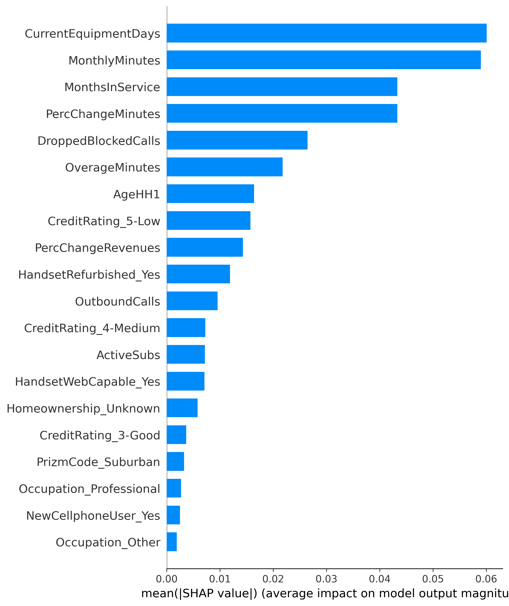{#fig-shap-importance-appendix width=80% fig-pos="H"}


### Semi-Supervised Learning SHAP Analysis {#sec-appendix-g3}

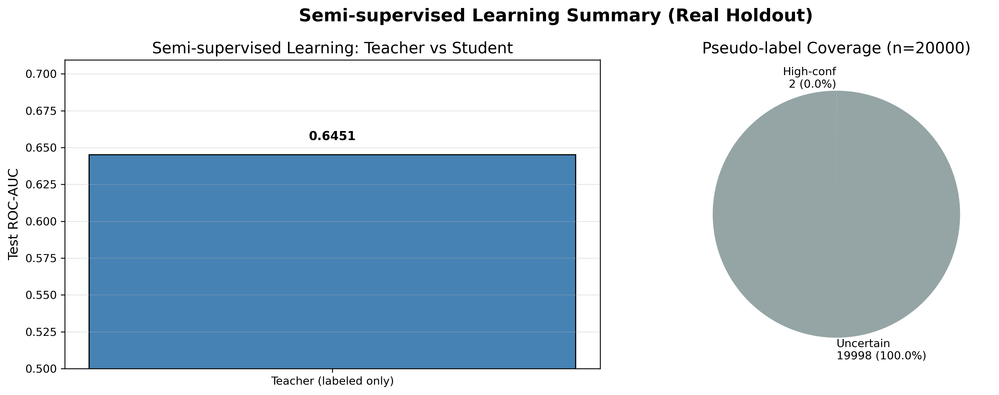{#fig-ssl-summary width=100% fig-pos="H"}


---

## Final Model Comparison and Evaluation {#sec-appendix-h}

### Model Comparison Curves {#sec-appendix-h1}

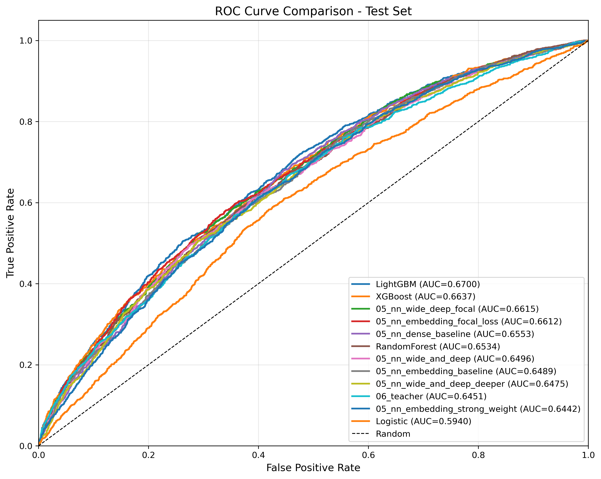{#fig-model-comparison-roc width=100% fig-pos="H"}


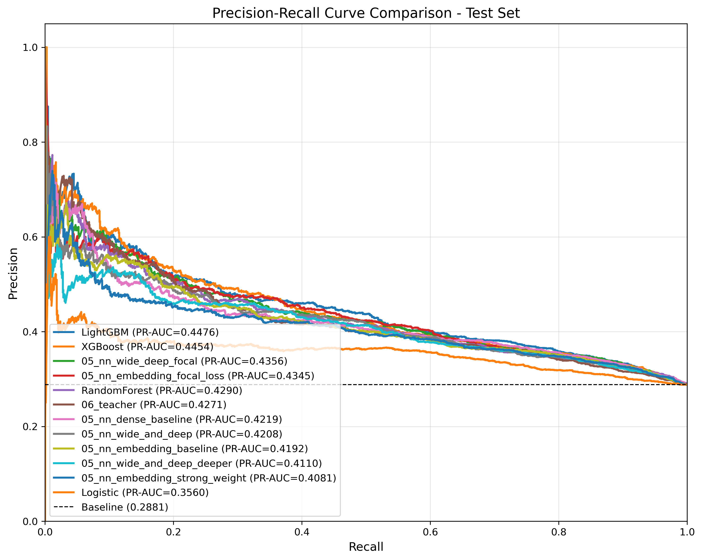{#fig-model-comparison-pr width=100% fig-pos="H"}


### Threshold Analysis {#sec-appendix-h2}

XGBoost threshold sweep on the validation set (N = 5,105; ~1,471 churners, ~3,634 non-churners). The optimal threshold τ = 0.4400 was selected by maximizing F1 subject to recall ≥ 0.70, then applied uniformly to all models.

| τ | TP | FP | TN | FN | Precision | Recall | F1 | Specificity |
|------|------|------|------|------|-----------|--------|-------|-------------|
| 0.1000 | 1471 | 3634 | 0 | 0 | 0.2882 | 1.0000 | 0.4475 | 0.0000 |
| 0.2000 | 1468 | 3551 | 83 | 3 | 0.2925 | 0.9980 | 0.4525 | 0.0228 |
| 0.3000 | 1368 | 3010 | 624 | 103 | 0.3125 | 0.9293 | 0.4677 | 0.1717 |
| 0.3500 | 1309 | 2674 | 960 | 162 | 0.3286 | 0.8899 | 0.4800 | 0.2641 |
| 0.4000 | 1221 | 2362 | 1272 | 250 | 0.3408 | 0.8300 | 0.4832 | 0.3501 |
| **0.4400** | **1141** | **2087** | **1547** | **330** | **0.3536** | **0.7757** | **0.4857** | **0.4257** |
| 0.5000 | 969 | 1567 | 2067 | 502 | 0.3821 | 0.6587 | 0.4837 | 0.5688 |

: XGBoost threshold sweep on the validation set (N = 5,105). τ = 0.4400 (bold) maximizes F1 subject to recall ≥ 0.70 and is applied uniformly to all models for comparability. All rows sum to N = 5,105. {#tbl-xgb-threshold-full}

### Model-Specific Optimal Thresholds {#sec-appendix-h3}

| Model | Fixed τ | Test F1 | Test Recall | Test Precision | Test ROC-AUC |
|-------|---------|---------|-------------|----------------|--------------|
| Logistic Regression | 0.4400 | 0.4560 | 0.8409 | 0.3128 | 0.5940 |
| XGBoost | 0.4400 | 0.4904 | 0.7390 | 0.3670 | 0.6637 |
| LightGBM | 0.4400 | 0.4969 | 0.7308 | 0.3764 | 0.6700 |
| Random Forest | 0.4400 | 0.4807 | 0.8042 | 0.3428 | 0.6534 |
| Wide&Deep (Focal) | 0.4400 | 0.0175 | 0.0088 | 0.7222 | 0.6615 |
| OOF Stacking (4 models) | 0.4400 | — | — | — | 0.6679 |
| OOF Stacking + Wide & Deep | 0.2243 | — | — | — | 0.6702 |

: Model performance at the fixed operational threshold τ = 0.4400, selected by maximizing F1 subject to recall ≥ 0.70 on the validation set for XGBoost, then applied uniformly. Stacking methods use a lower threshold (≈0.22) because the logistic meta-learner outputs probabilities on a compressed scale. Wide&Deep (Focal) exhibits near-zero recall at τ = 0.44 due to probability compression from focal loss, requiring threshold recalibration before deployment. {#tbl-optimal-thresholds}

### Calibration Metrics {#sec-appendix-h4}

| Model | Brier Score |
|-------|-------------|
| Logistic Regression | 0.2438 |
| XGBoost | 0.2233 |
| LightGBM | 0.2200 |
| Random Forest | 0.2290 |
| Wide&Deep (BCE) | 0.2364 |
| Wide&Deep (Focal) | 0.1970 |

: Brier scores across model families on the test set {#tbl-calibration-table}

**Note:** Focal loss models achieve lower Brier scores but higher ECE/MCE due to probability compression effect. Isotonic calibration recommended for deployment.

### Complete Model Leaderboard {#sec-appendix-h5}

The following table provides the complete model leaderboard with all evaluation metrics, serving as the definitive reference for model comparison.

```{python}
#| label: tbl-complete-leaderboard
#| tbl-cap: "Complete model leaderboard with validation and test metrics across all model families."
#| echo: false
#| warning: false
#| message: false

from pathlib import Path
import pandas as pd

def find_project_root(start: Path) -> Path:
    p = start.resolve()
    for _ in range(12):
        if (p / "_quarto.yml").exists() or (p / ".git").exists():
            return p
        if p.parent == p:
            break
        p = p.parent
    return start.resolve()

root = find_project_root(Path.cwd())
table_dir = root / "artifacts" / "tables"

candidates = list(table_dir.glob("08_model_leaderboard*.csv")) if table_dir.exists() else []
if candidates:
    df = pd.read_csv(candidates[0])
    from IPython.display import Markdown
    display(Markdown(df.to_markdown(index=False)))
else:
    print("Model leaderboard table not found. Expected: artifacts/tables/08_model_leaderboard.csv")
```

---

## Reproducibility Information {#sec-appendix-i}

### Software Environment {#sec-appendix-i1}

```
# Core ML Stack
python==3.10.12
numpy==1.24.3
pandas==2.0.3
scikit-learn==1.3.0
scipy==1.11.1

# Deep Learning
torch==2.0.1
torchvision==0.15.2

# Gradient Boosting
xgboost==1.7.6
lightgbm==4.0.0

# Experiment Tracking
mlflow==2.5.0
optuna==3.3.0

# Interpretability
shap==0.42.1

# Visualization
matplotlib==3.7.2
seaborn==0.12.2
plotly==5.15.0
```

### Random Seeds {#sec-appendix-i2}

```python
SEED_CONFIG = {
    'global_seed': 42,
    'train_test_split': 42,
    'cv_shuffle': 42,
    'numpy_seed': 42,
    'torch_seed': 42,
    'optuna_sampler': 42
}

# Seed initialization function
def set_all_seeds(seed: int = 42):
    import random
    import numpy as np
    import torch
    
    random.seed(seed)
    np.random.seed(seed)
    torch.manual_seed(seed)
    torch.cuda.manual_seed_all(seed)
    torch.backends.cudnn.deterministic = True
    torch.backends.cudnn.benchmark = False
```

### Data Split Statistics {#sec-appendix-i3}

| Split | N Samples | Churn Rate | % of Total |
|-------|-----------|------------|------------|
| Training | 40,837 | 28.8% | 80% |
| Validation | 5,105 | 28.8% | 10% |
| Test | 5,105 | 28.8% | 10% |
| **Total** | **51,047** | **28.8%** | **100%** |
| Holdout (unlabeled) | 20,000 | – | – |

: Data split statistics with class distribution {#tbl-split-statistics}

**Stratification:** All splits stratified by Churn label to maintain class balance.

### Artifact Manifest {#sec-appendix-i4}

| Artifact | Location | Description |
|----------|----------|-------------|
| T0_feature_registry.csv | ../artifacts/tables/ | Feature decision registry |
| preprocessor_fitted.pkl | models/ | Fitted sklearn preprocessor |
| xgb_best_model.json | models/ | Best XGBoost model |
| lgb_best_model.txt | models/ | Best LightGBM model |
| nn_wide_deep_focal.pt | models/ | Best PyTorch model weights |
| stacking_meta_learner.pkl | models/ | OOF stacking meta-learner |
| shap_explainer.pkl | models/ | SHAP TreeExplainer object |
| mlflow_experiment_*.db | mlruns/ | MLflow experiment database |
| optuna_study_*.db | optuna/ | Optuna study database |

: Complete artifact manifest for reproducibility {#tbl-artifact-list}

---

## Error Case Studies {#sec-appendix-j}

### False Negative Patterns {#sec-appendix-j1}

"Silent churners" are customers who churned but were assigned low churn probability by the model. Global SHAP analysis (@sec-global-interpretability) indicates that these cases typically lack the dominant risk signals the model relies on: they tend to have long service tenure (low positive SHAP from MonthsInService), stable or increasing usage (low or negative SHAP from PercChangeMinutes), and no support contact history (zero contribution from CustomerCareCalls). Their churn is likely driven by unobserved factors such as competitor promotions or household-level decisions not captured in the behavioral snapshot — the "silent churner" phenomenon discussed in @sec-limitations.

### False Positive Patterns {#sec-appendix-j2}

"False alarms" are customers predicted as high-risk churn who were ultimately retained. The SHAP dependence analysis (@sec-dependence-plots) suggests these cases are characterized by short service tenure (high positive SHAP from MonthsInService for new customers) combined with sharp short-term usage drops (high positive SHAP from PercChangeMinutes). New customers showing early distress signals — usage adjustments, initial support contacts — trigger the model's learned patterns for churn, but many stabilize once past the onboarding adjustment period. This points to a limitation of the static snapshot model: it cannot distinguish between transient early-tenure volatility and genuine pre-churn behavioral decline.
